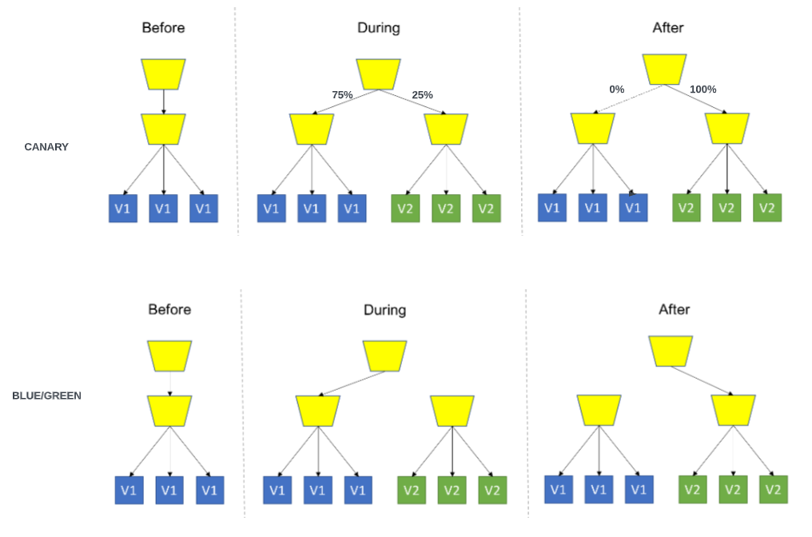
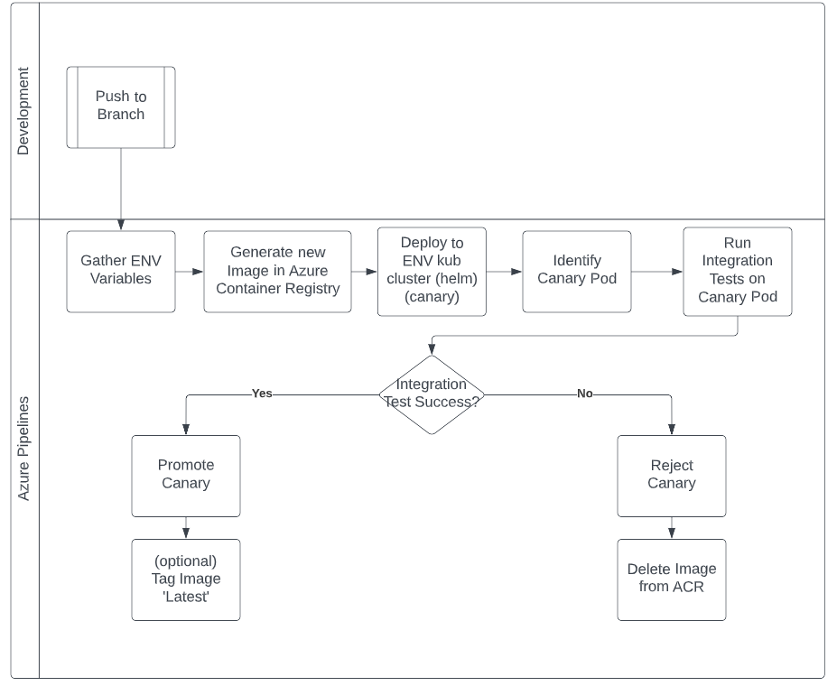
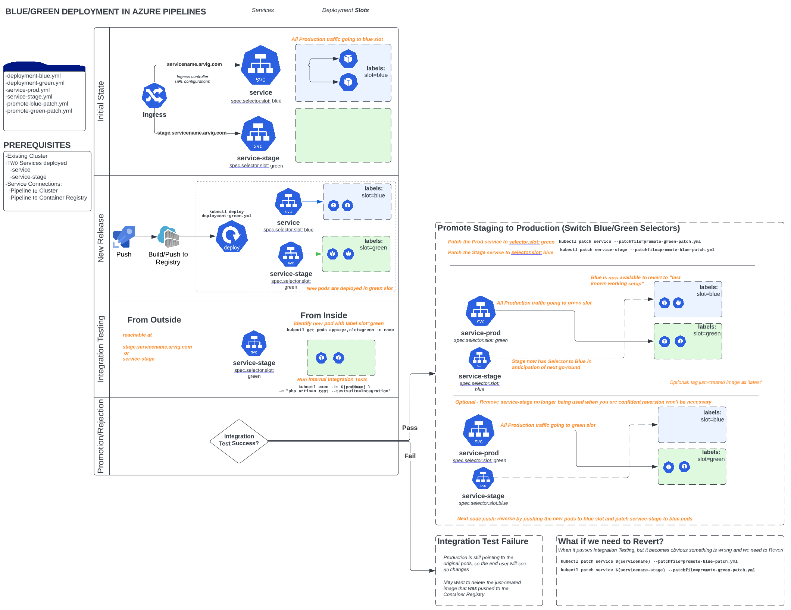

# AZURE PIPELINES DEPLOYMENT DEMO

This demonstrates deployment of a laravel app using two different strategies:

1. Canary
2. Blue/Green

## CANARY STRATEGY
Canary deployments are supported by Azure Pipelines out of the box via an option for deployments.

The canary pipeline file can be found in azure-pipelines-canary.yml

## BLUE/GREEN STRATEGY
Blue/Green deployments are NOT supported by Azure Pipelines out of the box via an option for deployments.

The blue/green pipeline file can be found in azure-pipelines-bluegreen.yml

## NOTES

1. Each of the pipeline yaml files will NOT work out of the box since the variables at the top of each were configured for a throwaway Azure Kubernetes cluster. You will need to create a new cluster and replace the variables accordingly.